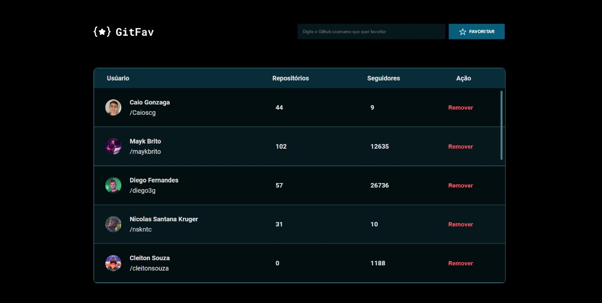

<h1 align="center">GitFav</h1>

A basic development to find and save GitHub users!

  <a href="#-technologies">Technologies</a>&nbsp;&nbsp;&nbsp;|&nbsp;&nbsp;&nbsp;
  <a href="#-project">Project</a>&nbsp;&nbsp;&nbsp;|&nbsp;&nbsp;&nbsp;
  <a href="#-site">Site</a>&nbsp;&nbsp;&nbsp;|&nbsp;&nbsp;&nbsp;
  <a href="#memo-license">License</a>

  

 

    

## 🛠️ Technologies

This project was developed with the following technologies:

- HTML and CSS
- JavaScript
- Figma
- Git and Github

## 💻 Project

- With this project you can save your favorite GitHub accounts!

## 🌐 Site

You can check the project with this link: https://gitfav-mu.vercel.app

## :memo: License

This project is under the MIT license.

---

Check my others projects!👋
